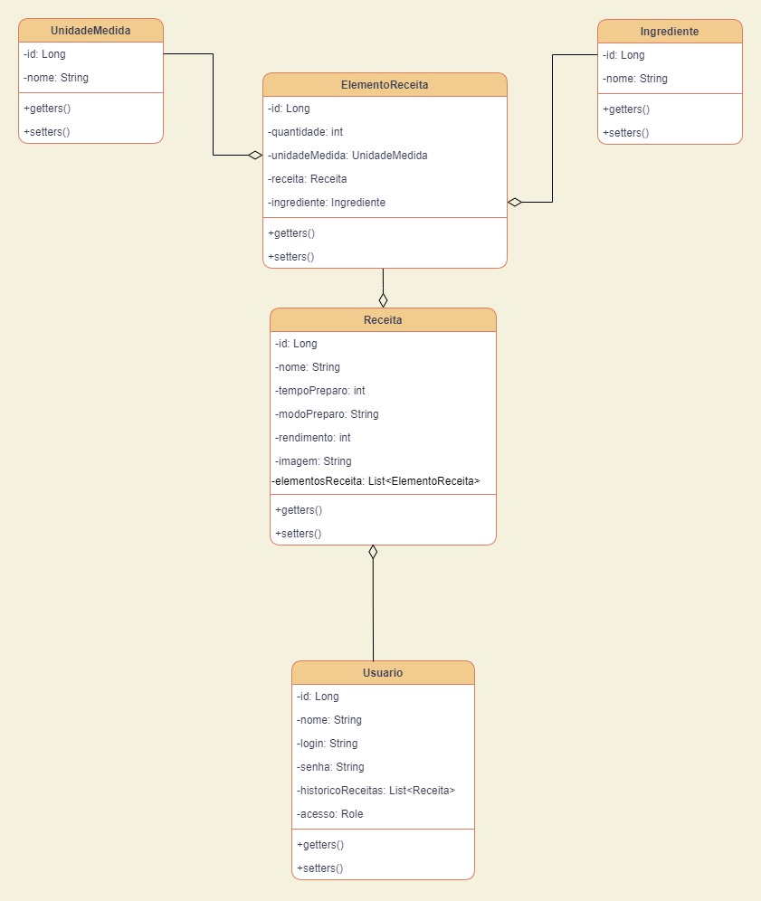
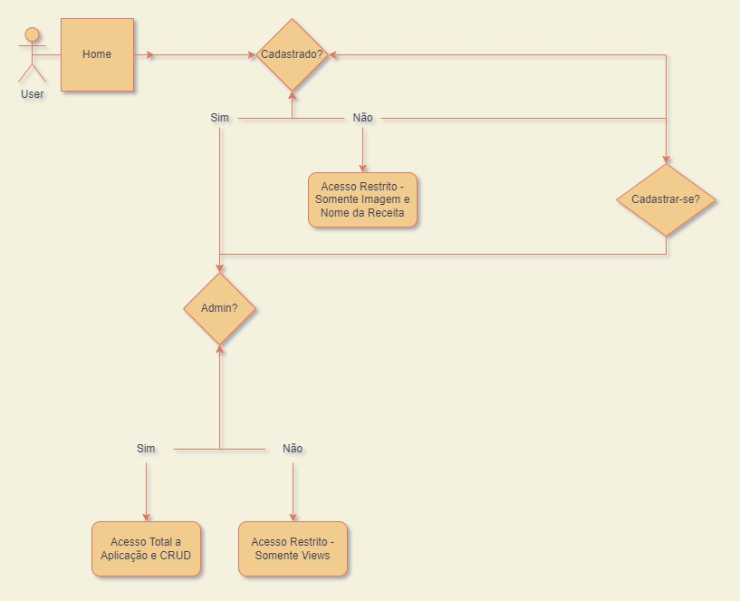

# Desafios MVC - Starter Program

## Objetivo

>### Criar um sistema no qual simule um site de receitas
>
> - Link para as [Diretrizes do Projeto](https://git.gft.com/prbv/desafio-mvc/-/tree/main/diretrizes)
## Ferramentas Utilizadas

> - Linguagem Java
> - JDK 17
> - Spring Boot
> - Spring Data JPA
> - Spring Validation
> - Spring Security
> - Spring Web
> - Spring Dev Tools
> - MySQL
> - Lombok
> - Thymeleaf
> - Maven
> - JUnit 5
> - Visual Studio Code
> - Bootstrap
> - Git

## UML de Classes

## Fluxogramas

## Wireframes

## Estrutura de Arquivos

#### O projeto foi organizado da seguinte forma:
#### 
> - A pasta cyber-coffee contém o projeto.
> - Todo desenvolvimento foi realizado através do VSCode.

## Tutorial
<ol>
    <li> Utilizando o Git, execute o seguinte comando no terminal: <code> git clone https://git.gft.com/prbv/desafio-mvc.git </code> </li>
    <li>Abra a pasta do projeto no Visual Studio Code</li>
    <li>Deverá ser feita a modificação do USER e PASSWORD no arquivo  "application.properties"</li>
</ol>

### Atenção! 
#### Alterei os valores de USER e PASSWORD no application.properties para "root" e "root", contudo deverá ser trocado se usar algum valor diferente destes.
